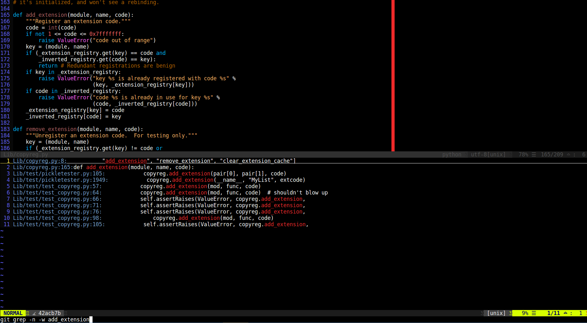

# gitgrep.vim

An easy way to issue a [git grep](https://git-scm.com/docs/git-grep) command across a git repository and navigate between the results.

## Pros

- Alternative (or addition) to *ctags* and *cscopse*.
- No need to refresh index.
- No dependencies.
- Cross language.

## Installation

Install using your favorite package manager, e.g., [Vundle](https://github.com/VundleVim/Vundle.vim):

1. Add the following to your .vimrc: `Plugin 'eranfrie/gitgrep.vim'`.
2. Reload .vimrc.
3. Run: `:PluginInstall`.

## Selection Menu:

- `j` / `k` / `Down` / `Up` / `PageDown` / `PageUp` to navigate the menu.
- `Enter` to select a result and jump to it.
- `Esc` / `Ctrl-C` to cancel.

## Commands:

- `GitGrep(flags, pattern)` - issue a *git grep* command and open the selection menu,
  where *flags* are [git grep](https://git-scm.com/docs/git-grep) flags (can be empty string)
  and *pattern* is the pattern to look for.

- `GitGrepBack()` - jump back to previous location.

## Customizations:

- Change the default *git grep* command

        let g:gitgrep_cmd = "grep -r"

- Set the height (number of lines) of the selection menu

        let g:gitgrep_menu_height = 15

- Set the color of the file path

        let g:gitgrep_file_color = "blue"

- Set the color of the matched pattern

        let g:gitgrep_pattern_color = "red"

## Mappings:

Keys are not automatically mapped. You can choose your own mappings, for example:

        nnoremap <leader>g :call GitGrep("-w", expand("<cword>"))<CR>
        nnoremap <leader>t :call GitGrepBack()<CR>
        command -bang -nargs=* GG call GitGrep("", expand(<q-args>))
        command -bang -nargs=* GGw call GitGrep("-w", expand(<q-args>))
        command -bang -nargs=* GGi call GitGrep("-i", expand(<q-args>))
