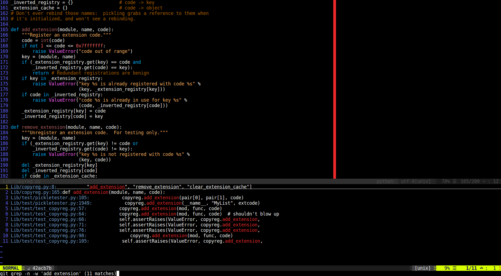

# gitgrep.vim

An easy way to issue a `git grep` command across a git repository and navigate between the results.

## Pros

- Alternative (or addition) to `ctags` and `cscopse`.
- No need to refresh index.
- No dependencies.
- Cross language.

## Installation

Install using your favorite package manager, e.g., [Vundle](https://github.com/VundleVim/Vundle.vim):

1. Add the following to your .vimrc: `Plugin 'eranfrie/gitgrep.vim'`.
2. Reload .vimrc.
3. Run: `:PluginInstall`.

## Selection Menu:

- `j` / `k` to scroll down / up.
- `Enter` to select a result and jump to it.
- `Esc` / `Ctrl-C` to cancel.

## Commands:

- `GitGrep(pattern)` - issue a `git grep` command and open the selection menu.
- `GitGrep_PrevLocation()` - jump back to previous location.

## Mappings:

Keys are not automatically mapped. You can choose your own mappings, for example:

        nnoremap <leader>g :call GitGrep("<cword>")<CR>
        nnoremap <leader>t :call GitGrep_PrevLocation()<CR>
